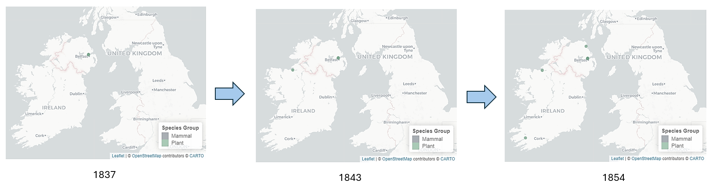
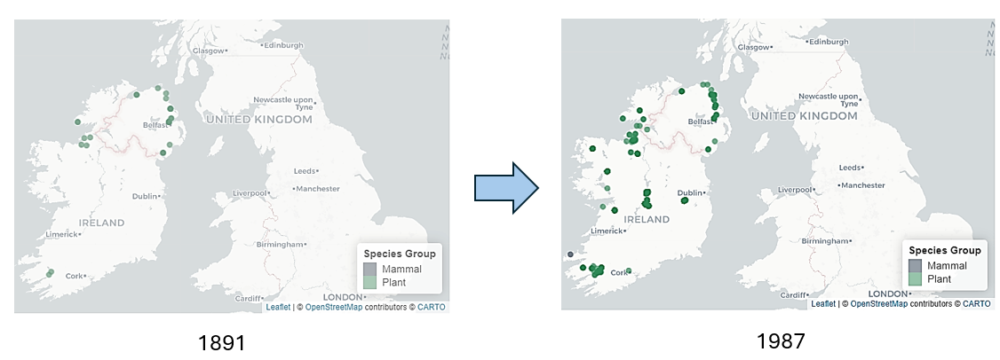
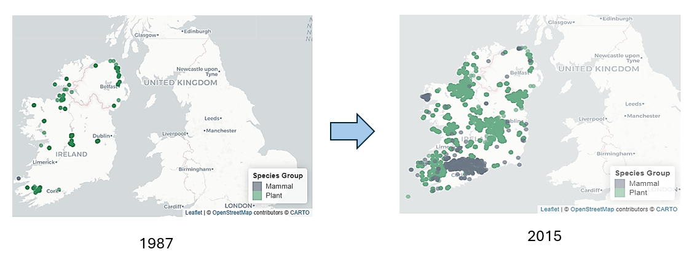
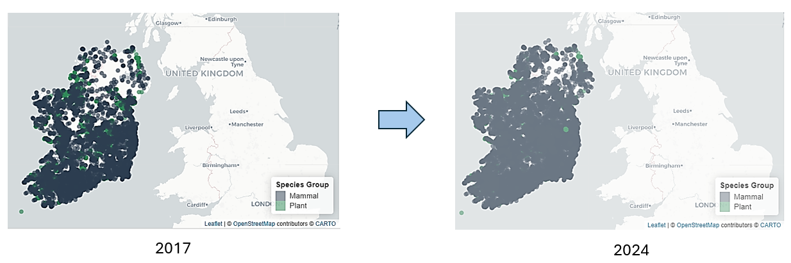
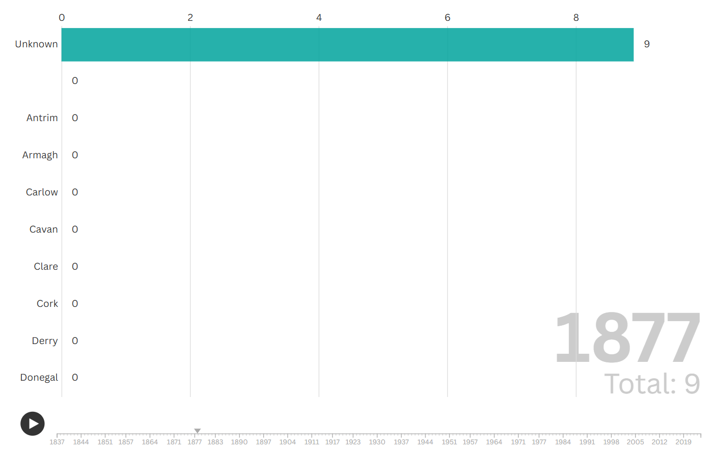
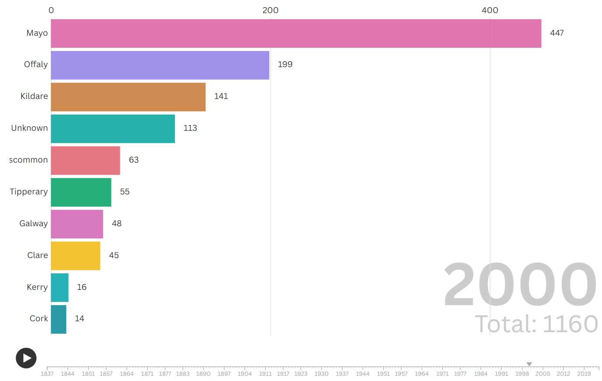
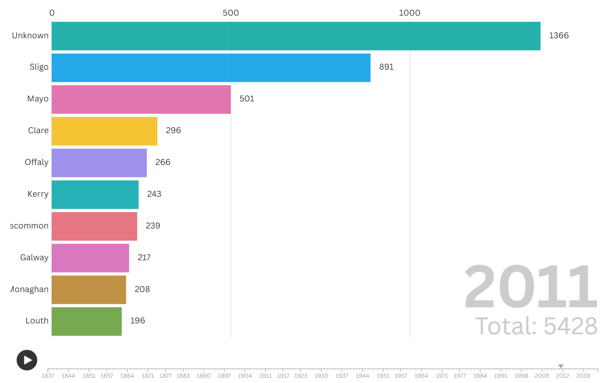
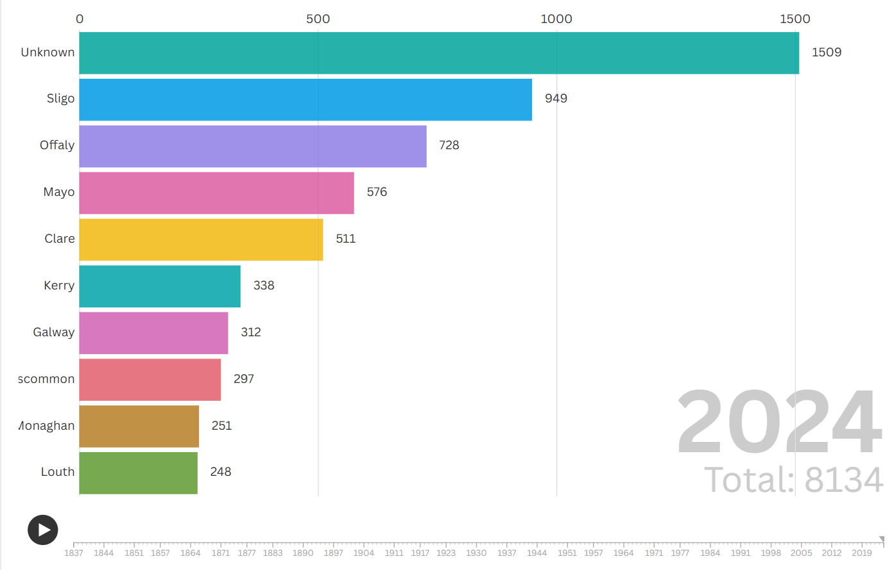

# 1. Introduction: Ireland's Biological Heritage

This project explores nearly two centuries of biodiversity data in Ireland, focusing on two key groups: **Plants** (habitat providers) and **Mammals** (consumers). Using a unified dataset from the National Biodiversity Data Centre, we analyze over 40,000 records to uncover how these species are distributed and how ecological recording has evolved since **1837**.

```{r packages and data import, warning=FALSE, message=FALSE}
library(readr)
library(here)
library(dplyr)
library(forcats)
library(leaflet)
library(crosstalk)
library(tidyr)
library(ggplot2)
library(plotly)

DB <- read.csv(here("Mammals_Plants_Dataset.csv"))

```

::: {align="center"}
[{width="368"}](https://encrypted-tbn0.gstatic.com/images?q=tbn:ANd9GcSdE873DyvO_1rDxvrWQOS-eP5wb48emx0-mg&s)
:::

# 2. Spatio-temporal distribution: The core analysis

To answer our primary research questions ---**how are species distributed and do they co-occur?**--- I have developed this interactive dashboard. It allows for a dynamic exploration of Ireland's biodiversity across both space and time.

-   **Interactive exploration**: Use the slider to navigate through the decades and the checkboxes to overlay or isolate the two biological groups.

-   **Ecological overlap**: By viewing both layers simultaneously, we can identify regions where plant diversity directly supports mammalian populations.

```{r warning=FALSE, message=FALSE}
# 1. Ensure Year is a clean integer and Date is correctly formatted
DB_map <- DB %>%
  filter(!is.na(lon), !is.na(lat), !is.na(Date)) %>%
  filter(Type %in% c("Plant", "Mammal")) %>%
  mutate(Year = as.integer(format(as.Date(Date), "%Y")))

# 2. Create a single SharedData object for all interactive elements
shared_data <- SharedData$new(DB_map)

# Define colors for the biological groups
pal_species <- colorFactor(
  palette = c("#2C3E50","#2E8B57"), 
  domain = DB_map$Type
)

# Create the interactive dashboard
bscols(
  widths = c(12),
  # 1. Time Slider (linked to shared_data)
  filter_slider("year_selector", "Select Observation Year", shared_data, ~Year, width = "100%"),
  
  # 2. Species Selector (replaces the Leaflet layer control for better compatibility)
  filter_checkbox("type_selector", "Select Species Group", shared_data, ~Type, inline = TRUE),
  
  # 3. The Map
  leaflet(shared_data) %>%
    addProviderTiles(providers$CartoDB.Positron) %>%
    setView(lng = -8, lat = 53.3, zoom = 7) %>%
    addCircleMarkers(
      lng = ~lon, lat = ~lat,
      radius = 4,
      color = ~pal_species(Type),
      fillOpacity = 0.65,
      stroke = FALSE,
      popup = ~paste0(
        "<b>Species:</b> ", TaxonName, "<br>",
        "<b>Group:</b> ", Type, "<br>",
        "<b>Year:</b> ", Year
      )
    ) %>%
    addLegend(
      position = "bottomright",
      pal = pal_species,
      values = ~Type,
      title = "Species Group"
    )
)

```

To truly understand the biodiversity of Ireland, we must look beyond static points and observe the **dynamic progression** of records over nearly two centuries. By interacting with the timeline, we can witness a story of discovery that begins with isolated botanical records and culminates in a modern explosion of faunal data.

## 2.1 The narrative of discovery: From 1837 to the present

The journey begins in **1837**, where a single green marker in the North-East (Northern Ireland) represents our first recorded plant species. For the next few decades, botanical discovery moved slowly and sporadically: a new record appeared in the North-West in **1843**, followed by another near the original site in **1852**, and a significant leap to the far South-West in **1854**.

```{r}

```

Throughout the late 19th century (1871--1885), new botanical records continued to emerge primarily in northern regions. Between **1891** and **1987**, we observe a progressive accumulation of green markers. These records began to cluster along the **coastal perimeters** before slowly moving inland toward the central plains.

```{r}

```

A pivotal shift occurred in **1987**, when the first mammal record appeared in the South-West. This marked the beginning of a new era. While plant records continued to intensify along the coasts, a dramatic "boom" in mammalian data occurred around **2015**, particularly in the South-East---an area that, until then, had shown lower botanical density.

```{r}

```

By **2017**, the map underwent a total transformation: a dense wave of blue markers (mammals) spread across the entire country, with a particular concentration in the southern and central regions. By 2024, the map reached its peak saturation, dominated by the dark blue of mammalian records.

```{r}

```

## 2.2 Key ecological insights

-   **Temporal bias vs. reality:** The sudden "saturation" of the map in the 21st century does not necessarily indicate a sudden increase in biological life, but rather a massive escalation in **sampling effort** and the adoption of digital recording tools.

-   **Species co-occurrence:** Interestingly, the data suggests a spatial "decoupling" in certain periods. While mammals eventually cover the whole island, their initial 21st-century boom occurred in areas where plant records were less dense, suggesting that sampling priorities might differ for botanical and zoological surveys.

-   **The power of citizen science:** The transition from a few isolated dots in the 1800s to a fully saturated map in 2024 is the visual proof of how **Citizen Science** has revolutionized our understanding of the natural world.

# 3. Temporal trends: The evolution of recording

## 3.1 The Biodiversity Race (Cumulative)

The map reveals a massive increase in records over time. To better understand this trend, the following **Bar Chart Race** visualizes the cumulative growth of species richness by county.

This animation highlights the shift from historical, scattered observations to the **modern era of digital citizen science**, where the volume of data has exploded.

```{r}
# 1. Prepare data: Count unique species per county and year
race_data <- DB_map %>%
  group_by(County, Year) %>%
  summarise(n_species = n_distinct(TaxonName), .groups = 'drop') %>%
  filter(!is.na(County))

# 2. Create a complete grid of years and counties so there are no gaps
all_years <- min(race_data$Year):max(race_data$Year)
all_counties <- unique(race_data$County)
full_grid <- expand.grid(Year = all_years, County = all_counties)

# 3. Merge, fill zeros, and calculate the CUMULATIVE sum
race_final <- full_grid %>%
  left_join(race_data, by = c("Year", "County")) %>%
  mutate(n_species = replace_na(n_species, 0)) %>%
  group_by(County) %>%
  mutate(cumulative_species = cumsum(n_species)) %>%
  ungroup()

# 4. Reshape to WIDE format (Flourish needs years as columns)
flourish_csv <- race_final %>%
  pivot_wider(id_cols = County, names_from = Year, values_from = cumulative_species)

# 5. Export to CSV
write.csv(flourish_csv, "biodiversity_race_ireland.csv", row.names = FALSE)

```

[Biodiversity race Ireland](https://public.flourish.studio/visualisation/27112446/)

## 3.2 A county-by-county perspective

This **Bar Chart Race** visualizes the cumulative growth of species richness across the top 10 counties and regions from **1837 to 2024**. More than just a competition of numbers, it tells the story of how geographical precision and sampling efforts have shifted over nearly two centuries.

### A Century of uncertainty (1837--1979)

For the first 140 years, the story of Irish biodiversity was shrouded in geographical ambiguity. Between 1837 and 1979, the majority of records lacked a specific county identification. These **"Unknown"** locations dominated the dataset, with up to 106 species accounted for but no clear regional home. This reflects a historical era where professional specimens were often labeled by "Ireland" or broad regions rather than precise modern counties.

```{r}

```

### The rise of regional in surveys (1979--2000)

The narrative changes dramatically in **1979**. For the first time, a specific county takes the lead: **Kildare** emerges with 13 species, quickly surpassing the previous "Unknown" totals. This marks the beginning of a more systematic, county-based recording approach.

By **1981**, the map of knowledge expands rapidly. New records flood in from **Mayo, Clare, Roscommon, and Offaly**. In a sudden surge, **Mayo** claims the top spot with 178 species, overshadowing Kildare\'s 139. By **1986**, the race intensifies: while Mayo remains the leader (254 species), **Offaly** climbs to second place (193), pushing Kildare down to third. This "Mayo dominance" continues into the early 2000s, reaching 447 species by the turn of the millennium.

```{r}

```

### Modern surges and the return of the unknown (2005--2024)

As we enter the 21st century, the data tells a dual story:

-   **The Sligo explosion:** In **2011**, **Sligo** makes a stunning entrance, skyrocketing to second place with 891 species and overtaking the long-standing leader, Mayo.

-   **The Big Data challenge:** Interestingly, by **2005**, the **"Unknown"** category returns to the top of the leaderboard (503 species). This trend continues until **2024**, where "Unknown" remains the most populated group with **1,509 species**.

```{r}

```

### Final rankings (2024)

By the end of our timeline, the biodiversity "leaderboard" reflects both intensive local surveying and the challenges of data standardization:

1.  **Unknown:** 1,509 species (reflecting large-scale digital imports without precise county tags).

2.  **Sligo:** 949 species.

3.  **Offaly:** 728 species. \... with **Monaghan** (251) and **Louth** (248) rounding out the top regions.

```{r}

```

# 4. Observation density (Heatmap)

While the interactive map and the bar chart race show us *where* and *how* records accumulated, this **Temporal heatmap** provides a definitive answer to our research question: **Are there clear temporal trends in species presence?**

```{r}
# 1. Prepare data for the heatmap: observations per decade
heatmap_data <- DB_map %>%
  mutate(Decade = (Year %/% 10) * 10) %>%
  group_by(Decade, Type) %>%
  summarise(Observations = n(), .groups = 'drop')

# 2. Create the Heatmap
p_heatmap <- ggplot(heatmap_data, aes(x = Decade, y = Type, fill = Observations)) +
  geom_tile() +
  scale_fill_gradient(low = "#e5f5f9", high = "#2ca25f") + # Green tones for biodiversity
  labs(title = "Temporal heatmap: Observation density by decade",
       x = "Decade",
       y = "Species Group",
       fill = "Records") +
  theme_minimal()

# Make it interactive
ggplotly(p_heatmap)
```

## 4.1 The Modern data explosion

### The silence of the past

The heatmap reveals a striking contrast between the 19th and 21st centuries. From **1837 until the late 1970s**, the density of records remains extremely low (represented by the pale, almost white tiles). Although biological recording existed, it was sporadic and limited to a few specialized specimens. For nearly 150 years, our "biological window" into Ireland's heritage was relatively narrow.

### The great acceleration (1980--2024)

The real story begins in the **1980s**, where we see the first significant shift in color density for Plants. However, the true "ecological revolution" is visible from the **year 2000 onwards**:

-   **Plants (The Pioneers):** The decade of **2000** shows the highest peak of intensity (the darkest green), with over **12,000 records**. This reflects a massive, coordinated effort to document Ireland's flora at the turn of the millennium.

-   **Mammals (The Recent Boom):** Interestingly, mammals show a slightly different pace. Their sampling intensity peaks later, during the **2010s and 2020s**. This suggests that while botanical surveys led the way, zoological interest has reached its maximum height in the most recent decade.

# 5. Conclusion: sampling effort vs. biological reality

The final heatmap confirms that the "trends" we observe are heavily influenced by **sampling effort**. The concentration of records in the last 40 years is not necessarily a sign that there are more species today than in 1850, but rather a testament to the **democratization of science**.

The transition from the pale tiles of the past to the vibrant green of the present illustrates how technology, mobile apps, and a more engaged public have transformed biodiversity from a niche academic pursuit into a collective national treasure.
